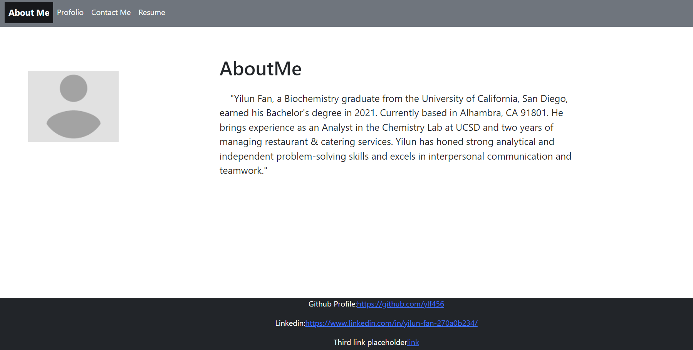

# React Portfolio

## Description

This portfolio webpage, built with HTML and CSS, utilizing React for the front-end, has been created by Yilun Fan. It serves as a showcase for biography and resume, also designed for study purposes.

## Installation

Open the following profile page link in your browser: https://heroic-kringle-c4e2bb.netlify.app/

local development: 
- any code editor
- go to my github repo and download the app folder into your local device: https://github.com/ylf456/module-20-challenge-ylf456-React-Portfolio.git
- install the required node packages by changing your terminal dir to root folder and run `npm i`
- run `npm run develop` to start the local server at port 3006

## Usage

This portfolio page made by React is for showcase of ylf456's porfile. 

If you want to use the template of this portfolio page for local development, please go to the github page and download the content to host the server on your local device.

## Credits

N/A

## License

MIT License

Copyright (c) 2024 ylf456

Permission is hereby granted, free of charge, to any person obtaining a copy
of this software and associated documentation files (the "Software"), to deal
in the Software without restriction, including without limitation the rights
to use, copy, modify, merge, publish, distribute, sublicense, and/or sell
copies of the Software, and to permit persons to whom the Software is
furnished to do so, subject to the following conditions:

The above copyright notice and this permission notice shall be included in all
copies or substantial portions of the Software.

THE SOFTWARE IS PROVIDED "AS IS", WITHOUT WARRANTY OF ANY KIND, EXPRESS OR
IMPLIED, INCLUDING BUT NOT LIMITED TO THE WARRANTIES OF MERCHANTABILITY,
FITNESS FOR A PARTICULAR PURPOSE AND NONINFRINGEMENT. IN NO EVENT SHALL THE
AUTHORS OR COPYRIGHT HOLDERS BE LIABLE FOR ANY CLAIM, DAMAGES OR OTHER
LIABILITY, WHETHER IN AN ACTION OF CONTRACT, TORT OR OTHERWISE, ARISING FROM,
OUT OF OR IN CONNECTION WITH THE SOFTWARE OR THE USE OR OTHER DEALINGS IN THE
SOFTWARE.

## Link to this application

Netlify link: https://heroic-kringle-c4e2bb.netlify.app/

Github Repo: https://github.com/ylf456/module-20-challenge-ylf456-React-Portfolio.git

## Screenshots

